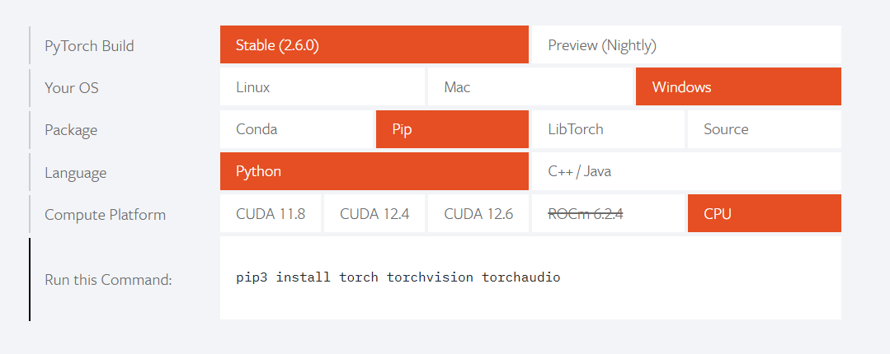

## はじめに
本プロジェクトでは、単純な構造の CNN を実装します。

## 環境構築
Anaconda を使用します。以下のコマンドで仮想環境を作成し、アクティブ化してください。

```bash
conda create --name [仮想環境名] --file requirements.txt
conda activate [仮想環境名]
```

PyTorch のインストールについては、[公式サイト](https://pytorch.org/) を参照してください。



## データのダウンロード
以下のリンクからデモデータをダウンロードしし、`./data/small-places/` となるように配置してください。

- デモデータ: https://drive.google.com/open?id=1QOm5lubtobVTts0c4ZpcDpdpmTZ-B5Pn
- ※元データ: https://www.kaggle.com/datasets/benjaminkz/places365

## 実行方法
1. `config.py` に分類したいクラスのディレクトリを記述します。
2. 以下のコマンドを実行してください。   
    ```bash
    python main.py
    ```