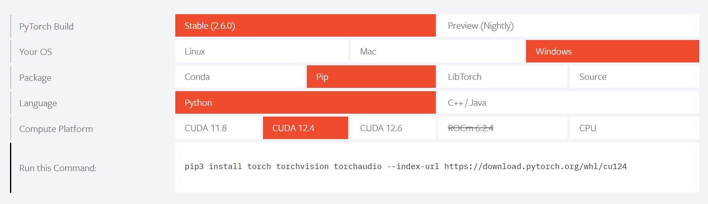

## はじめに
本プロジェクトでは、単純な構造の CNN を実装します。

## 環境構築 - Anaconda
以下のコマンドで仮想環境を作成し、アクティブ化してください。
Pytorchがcondaで入れられないので、パッケージのインストールは全てpipでお願いします。(ライブラリの競合を避けるため)

```bash
cd .devcontainer
conda create --name [仮想環境名] python=3.12.0
conda activate [仮想環境名]
pip install -r requirements.txt
cd ..
```

PyTorch のインストールについては、[公式サイト](https://pytorch.org/) を参照にコマンドを入手してください。




## 実行方法
1. `src/config.py` の `IMAGE_DIRS` に分類したいクラスのディレクトリを記述します。
2. 以下のコマンドを実行してください。   
    ```bash
    cd src
    python data_downloader.py # データのダウンロード(初回のみ)
    python main.py # 実行
    ```

## データのリンク
- デモデータ: https://drive.google.com/drive/folders/1IheiqhXHuR5DgX7-DY6Usc6sItROpYbL?usp=drive_link
- ※元データ: https://www.kaggle.com/datasets/benjaminkz/places365